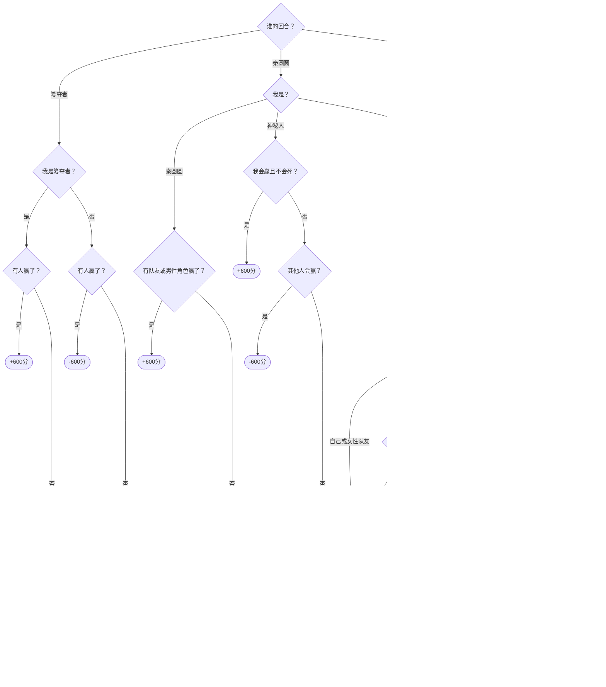

## 接收情报的分数计算

```mermaid
graph TD
    A{谁的回合？} -->|簒夺者| B{我是簒夺者？} -->|是| C{有人赢了？} -->|是| D([+600分])
    B -->|否| C1{有人赢了？} -->|是| D1([-600分])
    A -->|秦圆圆| F{我是？} -->|秦圆圆| E{有队友或男性角色赢了？} -->|是| G([+600分])
    F -->|神秘人| J{我会赢且不会死？} -->|是| K([+600分])
    J -->|否| L{其他人会赢？} -->|是| M([-600分])
    F -->|其他| N{接收者要赢了？} -->|是| O{接收者是？} -->|自己或女性队友| P([+600分])
    O -->|男性队友| Q{秦圆圆是队友？} --> |是| P
    Q -->|否| R([-600分])
    O -->|非队友| R
    A -->|其他| S{自己或队友要赢？} -->|是| T([+600分])
    S -->|否| U{敌人要赢？} -->|否| W[[后续判断]]
    U -->|是| V([-600分])
    C ------>|否| W
    C1 ------>|否| W
    E ------>|否| W
    L ------>|否| W
    N ------>|否| W
```
