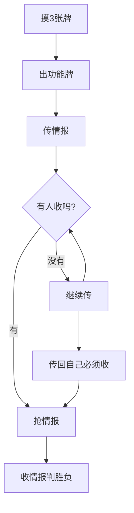

::: warning 注意
以下内容由AI生成，请注意仔细甄别。
:::

## 一、游戏目标与回合流程

### 1. 胜利条件一句话总结
- **红**&zwnj;**队（**&zwnj;**潜伏战线**&zwnj;**）**：自己或队友收满3张**红**/**红**&zwnj;**黑**情报
- **蓝**&zwnj;**队（**&zwnj;**特工机关**&zwnj;**）**：自己或队友收满3张**蓝**/**蓝**&zwnj;**黑**情报
- **神秘人**：完成身份牌上的特殊任务（每局不同）

### 2. 回合阶段详解

### 3. 新人易错点
- 忘记必须传情报导致直接出局
- 把**黑**情报误传给队友害死人
- 过早使用[调包](../card/card.md)/[截获](../card/card.md)等关键牌

## 二、基础生存指南

### 1. 前3回合必做三件事

1. [**试探**](../card/card.md)**找队友**
  - 用**红**摸一/**蓝**摸一的[试探](../card/card.md)（优先选自己阵营颜色）
  - 示例：你是**红**队，对手牌最多的玩家用**红**摸一[试探](../card/card.md)

2. **建立信任链**
  - 连续传2次同色给同一人
  - 如果对方也回传同色，大概率是队友

3. **保留关键牌**
  - [调包](../card/card.md)/[截获](../card/card.md)/[误导](../card/card.md)至少留1张
  - 前期优先用[试探](../card/card.md)/[平衡](../card/card.md)等低价值牌

### 2. 情报传递口诀
| 情报类型                              | 使用时机   | 注意事项          |
|-----------------------------------|--------|---------------|
| 纯**红**/**蓝**                      | 开局建立信任 | 别传给乱收**黑**牌的人 |
| **红**&zwnj;**黑**/**蓝**&zwnj;**黑** | 中期施压   | 确保队友**黑**牌≤2  |
| 纯**黑**                            | 终局收割   | 瞄准敌方2真玩家      |

### 3. 争夺阶段三原则
1. 优先抢带锁定的情报
2. 敌方2真时必用[截获](../card/card.md)
3. 自己快赢时留[误导](../card/card.md)防[调包](../card/card.md)

## 三、常见场景应对

### 1. 收到黑牌怎么办？
- 用[澄清](../card/card.md)保命（留至少1张[澄清](../card/card.md)）

### 2. 如何识破神秘人？
- 反常行为检测表：
  - [x] 乱传无关颜色
  - [x] 故意不收同色情报
  - [x] 突然大量传出**黑色**情报
  - [x] 保留过多[调包](../card/card.md)

### 3. 终局决胜口诀
- **红**&zwnj;**蓝**&zwnj;**队**：[调包](../card/card.md)+[截获](../card/card.md)+[误导](../card/card.md)，关键牌致胜
- **神秘人**：趁乱完成身份任务

## 四、卡牌使用速查表

| 卡牌                    | 一句话攻略   | 使用时机示例        |
|-----------------------|---------|---------------|
| [试探](../card/card.md) | 队友摸一找队友 | 第1回合找疑似队友     |
| [平衡](../card/card.md) | 抢牌差利器   | 敌方手牌≥4时使用     |
| [调包](../card/card.md) | 终局翻盘神器  | 敌方2真时换颜色      |
| [截获](../card/card.md) | 抢关键情报   | 争夺阶段最后出手      |
| [利诱](../card/card.md) | 赌运气控场   | 敌方2真时干扰用      |
| [澄清](../card/card.md) | 保命必备    | 自己2**黑**时扣在手里 |

## 五、八大必学技巧

1. **首回合传牌技巧**  
   **潜伏战线**&zwnj;**特工机关**优先传己方颜色

2. **已知身份后的传牌技巧**  
   优先向已验证队友传递情报

3. **手牌管理口诀**  
   "三留一保"：留[调包](../card/card.md)/[截获](../card/card.md)/[误导](../card/card.md)，保3张手牌

4. **假动作战术**  
   如果你是**神秘人**，可以假装**潜伏战线**&zwnj;**特工机关**迷惑对手

5. **最后一击**  
   当多名敌对玩家已有2**黑**时，把**黑**牌传给最大威胁者（小心[镇压者](../card/secret_task.md)、[先行者](../card/secret_task.md)、[清道夫](../card/secret_task.md)）

6. **听牌策略**  
   自己或队友有己方阵营2真时，全力传递本阵营颜色

7. **新手禁用操作**  
   前5回合不用[调包](../card/card.md)/不传纯**黑**

8. **阵营方不要乱传黑**  
    不要乱传**黑**，以防帮助**神秘人**完成任务
