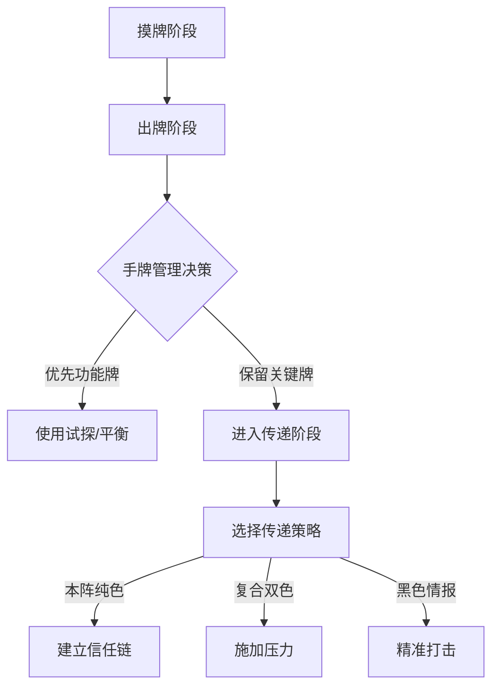

::: warning 注意
以下内容由AI生成，请注意仔细甄别。
:::

## 一、游戏机制深度解析

### 1. 回合流程精密控制


### 2. 卡牌价值评估体系
|         卡牌类型          | 战略权重  | 使用阶段 | 预期收益       |
|:---------------------:|-------|------|------------|
| [调包](../card/card.md) | ★★★★★ | 终局阶段 | 改变情报颜色逆转局势 |
| [截获](../card/card.md) | ★★★★☆ | 争夺阶段 | 直接控制情报归属   |
| [平衡](../card/card.md) | ★★★★☆ | 中期阶段 | 制造3张以上手牌差  |
| [试探](../card/card.md) | ★★★☆☆ | 前期阶段 | 获取身份信息基准值  |

## 二、核心战术模块

### 1. 本阵纯色传递原则

- 前3回合优先建立信任链
- 采用直达传递（↑箭头）降低拦截风险

### 2. 复合双色施压策略

- 经常传递形成持续压力
- 配合调包形成颜色转换威胁

### 3. 黑色情报精准打击

- 优先选择2**黑**的目标
- 配合威逼/平衡形成组合打击
- 配合锁定标记确保目标接收

### 4. 核心卡牌使用规范

| 卡牌                        | 官方效果         | 战术价值   | 正确使用策略                           |
|---------------------------|--------------|--------|----------------------------------|
| [**利诱**](../card/card.md) | 牌堆顶的牌置入目标情报区 | 概率控制工具 | ①通过概率调整干扰敌方<br/>②通过概率调整帮助队友/置换手牌 |
| [**平衡**](../card/card.md) | 双方弃牌后各摸3张    | 资源调控核心 | ①敌方手牌≥4时压制<br/>②队友手牌≤2时补充        |
| [**威逼**](../card/card.md) | 强制获取特定类型卡牌   | 情报侦查手段 | ①获取敌方关键卡牌<br/>②查看敌方手牌            |

## 三、胜率TOP5深度解析

| 角色        | 胜率     | 核心机制         | 精准操作                  |
|-----------|--------|--------------|-----------------------|
| **SP程小蝶** | 40.96% | 置入牌顶情报并回收非黑牌 | 中后期发动改变局势             |
| **黄济仁**   | 40.49% | 展示双色弃对应情报    | 保留**红**/**蓝**手牌针对2真目标 |
| **小九**    | 39.32% | 首回合建立优势      | 传递本阵纯色情报              |
| **秦圆圆**   | 38.89% | 与宣胜男性共同胜利    | 监控已翻面男性角色动向           |
| **裴玲**    | 38.31% | 抽取2牌后按黑情报数归还 | 主动收集**黑**情报减少归还           |

## 四、阵营协作精密框架

### 1. 主阵营标准操作协议

| 阵营       | 传递策略                       | 验证手段        | 决胜操作     |
|----------|----------------------------|-------------|----------|
| **潜伏战线** | 持续传递**红**/**红**&zwnj;**黑** | **红**摸一试探优先 | 灵活使用本阵双色 |
| **特工机关** | 持续传递**蓝**/**蓝**&zwnj;**黑** | **蓝**摸一试探优先 | 灵活使用本阵双色 |

### 2. 情报验证黄金法则

#### 1. **双重验证机制**
  - 第1次传递后使用同色试探
  - 第2次传递后观察保护行为

#### 2. **异常行为识别**
  - 连续拒绝接收本阵颜色
  - 反常使用黑色情报
  - 刻意保留调包/截获

#### 3. **信任链构建公式**

```
信任值 = 同色传递次数 × 0.7 
        + 保护行为次数 × 0.3 
        - 异常行为次数 × 1.0
```

### 3. 神秘人精准操作矩阵

| 身份                                | 核心策略      | 关键操作         |
|-----------------------------------|-----------|--------------|
| [**篡夺者**](../card/secret_task.md) | 控制终局阶段    | 保留误导/调包      |
| [**先行者**](../card/secret_task.md) | 死亡时需携带真情报 | 主动接收**黑**情报  |
| [**镇压者**](../card/secret_task.md) | 自己回合完成击杀  | 终局传**黑**制造濒死 |

## 五、战术决策框架

### 1. 卡牌优先级准则

| 阶段  | 优先卡牌     | 说明      |
|-----|----------|---------|
| 全阶段 | 截获/误导/调包 | 情报控制三核心 |
| 前期  | 试探/平衡    | 建立资源优势  |
| 终局  | 调包       | 决胜关键操作  |

### 2. 情报传递策略表

| 类型     | 使用原则     | 战术目标   |
|--------|----------|--------|
| 本阵纯色   | 任何阶段安全传递 | 积累胜利条件 |
| 本阵双色   | 持续施压     | 加速胜利进程 |
| 纯**黑** | 精准击杀     | 清除威胁角色 |

## 六、高阶决策模型

### 1. 动态风险评估体系
| 风险等级  | 判断标准    | 应对策略         |
|-------|---------|--------------|
| ★☆☆☆☆ | 敌方0真情报  | 加速传递建立优势     |
| ★★☆☆☆ | 敌方1真情报  | 开始使用调包干扰     |
| ★★★☆☆ | 敌方2真情报  | 保留截获/误导防御    |
| ★★★★☆ | 敌方2真+调包 | 启动终局组合技      |
| ★★★★★ | 敌方宣胜倒计时 | 全力使用**黑**色情报 |

### 2. 资源控制方程式

- **手牌价值公式**
  ```
  V = (截获×1.5 + 调包×1.3 + 误导×1.2) 
    - (试探×0.8 + 平衡×0.7)
  ```
- **情报价值公式**
  ```
  Q = 本阵颜色×2 + 黑色情报×1.5 
    - 敌方颜色×1.2
  ```
