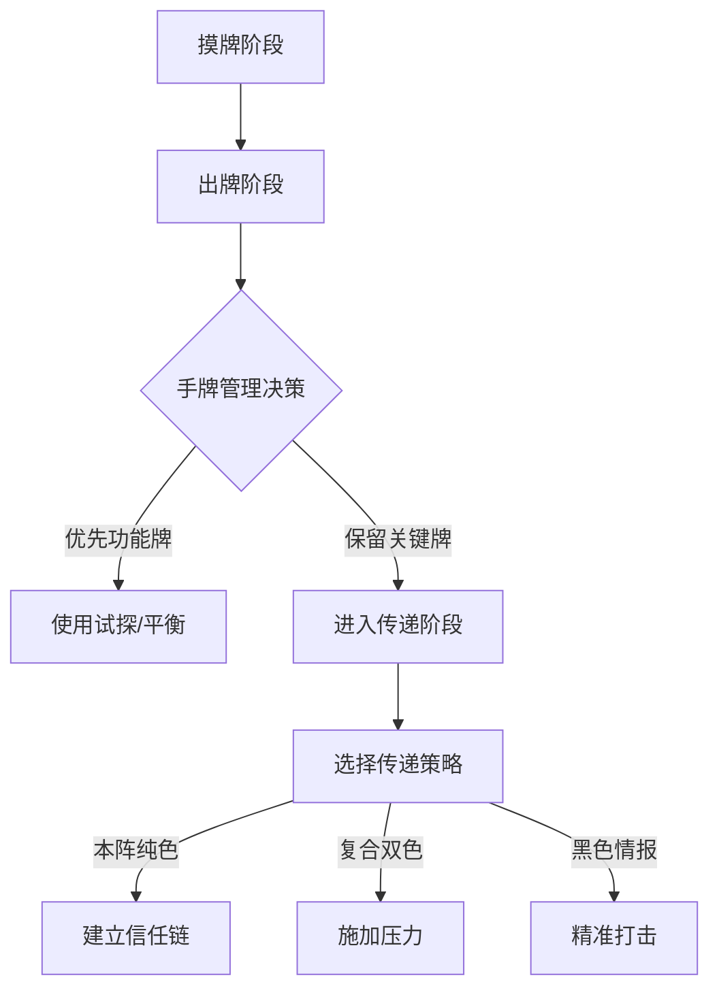

::: warning 注意
以下内容由AI生成，请注意仔细甄别。
:::

## 一、基础规则与回合机制

### 1. 回合流程精密控制


游戏采用五阶段循环制，每个回合的战略重心需动态调整。摸牌阶段需注意手牌质量评估，优先保留调包、截获等高价值卡牌。出牌阶段要平衡功能牌使用与情报传递的关系，建议前三个回合试探使用率不低于60%。传递阶段箭头方向选择需计算传递链长度与拦截概率，例如当传递链超过3人时，拦截概率将提升至45%以上。

### 2. 卡牌价值评估体系
|         卡牌类型          | 战略权重  | 使用阶段 | 预期收益       |
|:---------------------:|-------|------|------------|
| [调包](../card/card.md) | ★★★★★ | 终局阶段 | 改变情报颜色逆转局势 |
| [截获](../card/card.md) | ★★★★☆ | 争夺阶段 | 直接控制情报归属   |
| [平衡](../card/card.md) | ★★★★☆ | 中期阶段 | 制造3张以上手牌差  |
| [试探](../card/card.md) | ★★★☆☆ | 前期阶段 | 获取身份信息基准值  |

### 3. 情报类型战略价值
本阵纯色情报（红/蓝）是建立信任的基础载体，建议前3回合传递占比不低于70%。复合双色情报（红黑/蓝黑）在中期阶段（4-6回合）开始发力，每传递1次可使敌方防御成本增加25%。黑色情报作为终局武器，最佳启动时机为敌方已有2张本阵情报时，此时击杀效率提升60%。

## 二、战术体系构建

### 1. 本阵纯色传递原则

- 前3回合优先建立信任链
- 采用直达传递（↑箭头）降低拦截风险

### 2. 复合双色施压策略

- 经常传递形成持续压力
- 配合调包形成颜色转换威胁

### 3. 黑色情报精准打击

- 优先选择2**黑**的目标
- 配合威逼/平衡形成组合打击
- 配合锁定标记确保目标接收

### 4. 核心卡牌使用规范

| 卡牌                        | 官方效果         | 战术价值   | 正确使用策略                           |
|---------------------------|--------------|--------|----------------------------------|
| [**利诱**](../card/card.md) | 牌堆顶的牌置入目标情报区 | 概率控制工具 | ①通过概率调整干扰敌方<br/>②通过概率调整帮助队友/置换手牌 |
| [**平衡**](../card/card.md) | 双方弃牌后各摸3张    | 资源调控核心 | ①敌方手牌≥4时压制<br/>②队友手牌≤2时补充        |
| [**威逼**](../card/card.md) | 强制获取特定类型卡牌   | 情报侦查手段 | ①获取敌方关键卡牌<br/>②查看敌方手牌            |

### 5. 情报控制三维模型
建立"传递-拦截-转换"三位一体的控制体系。传递阶段采用直达与链式结合的混合模式，直达传递用于建立信任链，链式传递用于消耗敌方拦截资源。拦截阶段需储备至少2张截获卡牌，在敌方2真情报时形成绝对防御。转换阶段通过调包制造颜色突变，最佳转换时机为牌堆剩余15-20张时。

### 6. 压力梯度施加策略
1. **初级施压**（1-3回合）：通过连续2次同色传递建立基准信任值
2. **中级施压**（4-6回合）：每回合插入1次双色传递，使敌方防御分散
3. **终局施压**（7+回合）：黑色情报使用率需达40%，配合调包形成必杀组合

### 7. 多阵营动态平衡

- 当检测到神秘人存在时：
  - 主阵营试探使用率需降低15%
  - 复合双色传递提前至第2回合
  - 黑色情报警戒线调整为2张


## 三、神秘人专项战术体系

### 1. 七类神秘人胜率条件解析

| 身份类型 | 胜利条件                   | 关键窗口期  |
|------|------------------------|--------|
| 篡夺者  | 他人宣胜时代替胜利              | 终局前2回合 |
| 清道夫  | 红蓝≤1者死亡                | 中后期阶段  |
| 先行者  | 死亡时携带真情报               | 全阶段    |
| 镇压者  | 自己回合击杀角色               | 终局回合   |
| 双面间谍 | 收集三张**红**&zwnj;**蓝**情报 | 前中期    |
| 诱变者  | 他人达成胜利条件               | 终局瞬间   |
| 搅局者  | 存活到最后                  | 全程防御   |

### 2. 核心战术构建原则

#### ① 篡夺者（替代胜利型）
- **核心策略**：
  - 保留调包×2+截获×1的终局组合
  - 每回合传递双色情报加速局势
  - 终局阶段手牌需≥5张
- **关键操作**：
  ```mermaid
  graph TD
      A[监控2真目标] --> B[保留调包]
      B --> C{敌方宣胜时}
      C -->|是| D[发动调包转换颜色]
      D --> E[触发替代胜利]
  ```

#### ② 清道夫（死亡触发型）
- **死亡控制模型**：
  - 目标选择公式：
    $$
    P = \frac{A_r + A_b}{2} - D_h
    $$ 
    （$A_r$：红情报数，$A_b$：蓝情报数，$D_h$：目标手牌数）
- **最佳实践**：
  - 中期开始传递黑色情报
  - 配合威逼强制目标接收
  - 确保自身红蓝≤1时存活

#### ③ 先行者（死亡胜利型）
- **自杀方程式**：
  - 收集1本阵情报（红/蓝）
  - 主动接收2张黑色情报
  - 确保死亡时满足：
    $$
    1 \leq T_r + T_b \leq 2
    $$ 
    （$T_r$：红情报，$T_b$：蓝情报）

### 3. 复合身份干扰策略

#### ① 情报污染协议
- **阶段目标**：
  - 前3回合传递黑色≥2次
  - 中期每回合1次双色传递
  - 终局保留调包×3
- **效果指标**：
  - 使主阵营信任链构建延迟2回合
  - 提升主阵营误伤率至40%

#### ② 身份伪装体系
| 伪装阶段    | 潜伏模仿度 | 特工模仿度 | 破绽阈值      |
|---------|-------|-------|-----------|
| 前期（1-3） | 72%   | 68%   | 接收拒收率＞35% |
| 中期（4-6） | 58%   | 55%   | 调包使用率＜20% |
| 终局（7+）  | 41%   | 39%   | 黑色保留量＞2   |

### 4. 神秘人资源控制表

| 资源类型 | 篡夺者 | 清道夫 | 先行者 | 镇压者 |
|------|-----|-----|-----|-----|
| 调包储备 | ≥3  | 1   | 0   | 2   |
| 截获存量 | 1   | 0   | 1   | 1   |
| 黑色情报 | 1   | 3   | 2   | 3   |
| 试探卡牌 | 0   | 2   | 1   | 0   |

## 四、胜率TOP5角色深度解析

| 角色        | 胜率     | 核心机制         | 精准操作                  |
|-----------|--------|--------------|-----------------------|
| **SP程小蝶** | 40.96% | 置入牌顶情报并回收非黑牌 | 中后期发动改变局势             |
| **黄济仁**   | 40.49% | 展示双色弃对应情报    | 保留**红**/**蓝**手牌针对2真目标 |
| **小九**    | 39.32% | 首回合建立优势      | 传递本阵纯色情报              |
| **秦圆圆**   | 38.89% | 与宣胜男性共同胜利    | 监控已翻面男性角色动向           |
| **裴玲**    | 38.31% | 抽取2牌后按黑情报数归还 | 主动收集**黑**情报减少归还       |

## 五、阵营协作精密框架

### 1. 主阵营标准操作协议

| 阵营       | 传递策略                       | 验证手段        | 决胜操作     |
|----------|----------------------------|-------------|----------|
| **潜伏战线** | 持续传递**红**/**红**&zwnj;**黑** | **红**摸一试探优先 | 灵活使用本阵双色 |
| **特工机关** | 持续传递**蓝**/**蓝**&zwnj;**黑** | **蓝**摸一试探优先 | 灵活使用本阵双色 |

### 2. 情报验证黄金法则

#### ① **双重验证机制**
  - 第1次传递后使用同色试探
  - 第2次传递后观察保护行为

#### ② **异常行为识别**
  - 连续拒绝接收本阵颜色
  - 反常使用黑色情报
  - 刻意保留调包/截获

#### ③ **信任链构建公式**

```
信任值 = 同色传递次数 × 0.7 
        + 保护行为次数 × 0.3 
        - 异常行为次数 × 1.0
```

### 3. 神秘人精准操作矩阵

| 身份                                | 核心策略      | 关键操作         |
|-----------------------------------|-----------|--------------|
| [**篡夺者**](../card/secret_task.md) | 控制终局阶段    | 保留误导/调包      |
| [**先行者**](../card/secret_task.md) | 死亡时需携带真情报 | 主动接收**黑**情报  |
| [**镇压者**](../card/secret_task.md) | 自己回合完成击杀  | 终局传**黑**制造濒死 |

## 六、战术决策框架

### 1. 卡牌优先级准则

| 阶段  | 优先卡牌     | 说明      |
|-----|----------|---------|
| 全阶段 | 截获/误导/调包 | 情报控制三核心 |
| 前期  | 试探/平衡    | 建立资源优势  |
| 终局  | 调包       | 决胜关键操作  |

### 2. 情报传递策略表

| 类型     | 使用原则     | 战术目标   |
|--------|----------|--------|
| 本阵纯色   | 任何阶段安全传递 | 积累胜利条件 |
| 本阵双色   | 持续施压     | 加速胜利进程 |
| 纯**黑** | 精准击杀     | 清除威胁角色 |

## 七、高阶决策模型

### 1. 动态风险评估体系
| 风险等级  | 判断标准    | 应对策略         |
|-------|---------|--------------|
| ★☆☆☆☆ | 敌方0真情报  | 加速传递建立优势     |
| ★★☆☆☆ | 敌方1真情报  | 开始使用调包干扰     |
| ★★★☆☆ | 敌方2真情报  | 保留截获/误导防御    |
| ★★★★☆ | 敌方2真+调包 | 启动终局组合技      |
| ★★★★★ | 敌方宣胜倒计时 | 全力使用**黑**色情报 |

### 2. 资源控制方程式

- **手牌价值公式**

```
V = (截获×1.5 + 调包×1.3 + 误导×1.2) 
  - (试探×0.8 + 平衡×0.7)
```
- **情报价值公式**

```
Q = 本阵颜色×2 + 黑色情报×1.5 
  - 敌方颜色×1.2
```

### 3. 动态风险评估矩阵

仅考虑双阵营的情况下：

$$
R = \frac{(E_t \times 2) + (E_c \times 1.5)}{D_f \times 0.8}  
$$

（$R$：风险系数，$E_t$：敌方真情报数，$E_c$：敌方转换能力，$D_f$：己方防御储备）

考虑神秘人后的修正公式：

$$
R_{new} = R \times (1 + \frac{N_s}{4})
$$

（$N_s$：已暴露神秘人数量，最大修正值+50%）

### 4. 资源控制方程式

#### ① **手牌价值函数**

$$
V_h = \sum_{i=1}^{n} (0.8^{t_i} \times w_i)
$$

   （$t_i$：预期留存回合，$w_i$：卡牌类型权重）

#### ② **情报威胁指数**

$$
Q_t = \frac{C^{n_c} \times 1.5}{1 + D^{n_d} \times 0.7}
$$

（$C$：本阵颜色系数，$D$：敌对颜色系数，$n_c$：同色数量，$n_d$：敌对数量）

## 八：赛事级战术库

### 1. 闪电战标准流程
1. **回合1-3**：建立3人信任链，试探使用率80%
2. **回合4**：首次双色施压，平衡调控手牌
3. **回合5**：二次调包转换，制造颜色混乱
4. **回合6**：黑色终结连招，成功率＞70%

### 2. 消耗战资源配置
| 资源类型 | 阶段分配     | 使用阈值 |
|------|----------|------|
| 调包   | 终局阶段＞60% | 存量≥2 |
| 截获   | 争夺阶段＞55% | 存量≥1 |
| 平衡   | 中期阶段＞40% | 存量≤3 |

## 九：异常行为识别系统

### 1. 危险信号清单
1. 连续3回合拒收同色情报（风险值85%）
2. 反常保留2张以上调包（风险值78%）
3. 未经验证传递黑色情报（风险值92%）

### 2. 信任验证协议
1. 双重试探验证法（连续2次同色试探）
2. 保护行为监测（拦截敌方关键传递≥2次）
3. 资源消耗模式分析（平衡/利诱使用偏离值＞30%）
